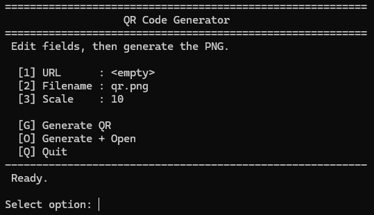

# QuickQRForge

[](https://github.com/Hibob555556/QRGenerator/actions/workflows/ci.yml)
[](https://github.com/Hibob555556/QRGenerator/blob/main/LICENSE)



Generate URL QR codes as PNG files using either:

- an interactive terminal UI (TUI), or
- a script-friendly command-line interface (CLI).

> The CLI is exposed via the `qrgen` command once the package is installed
> from PyPI; no additional setup is necessary.

## Quick Start

```powershell
pip install QuickQRForge
qrgen https://example.com --output qr.png --scale 10
```

## Features

- Interactive TUI mode
- Non-interactive CLI mode for app/script integration
- URL normalization (`https://` auto-added when missing)
- Input validation and meaningful exit codes
- GitHub Actions CI and basic test coverage

## Installation

Install from PyPI:

```powershell
pip install QuickQRForge
```

Optional: install/upgrade to the latest release:

```powershell
pip install --upgrade QuickQRForge
```

## Usage

### TUI Mode

```powershell
qrgen
```

Or:

```powershell
qrgen --tui
```

### CLI Mode

Positional URL:

```powershell
qrgen https://example.com
```

Flag-based URL:

```powershell
qrgen --url https://example.com --output qr.png --scale 10
```

## Example Usage

Generate `qr.png` from a URL using defaults:

```powershell
qrgen https://example.com
```

Generate a QR code with a custom file name and scale:

```powershell
qrgen https://openai.com --output openai-qr.png --scale 12
```

Use the flag-based URL argument (useful in scripts):

```powershell
qrgen --url https://github.com --output github.png --scale 8
```

Start in interactive TUI mode:

```powershell
qrgen --tui
```

## Use in Python Code

This project is packaged as a CLI tool. To use it inside your Python code, call the `qrgen` command with `subprocess`:

```python
import subprocess

def make_qr(url: str, output: str = "qr.png", scale: int = 10) -> None:
    subprocess.run(
        ["qrgen", url, "--output", output, "--scale", str(scale)],
        check=True,
    )

make_qr("https://example.com", "example-qr.png", 12)
```

Use the flag-based URL argument (useful in scripts):

```powershell
qrgen --url https://github.com --output github.png --scale 8
```

Start in interactive TUI mode:

```powershell
qrgen --tui
```

## Use in Python Code

The library can be imported directly in Python.  The public API originally
lived in the ``qrgen`` module, but the package was renamed and the canonical
import path is now ``quickqrforge``.  The old module still exists and issues a
``DeprecationWarning`` when imported, so you can update at your leisure.

```python
import quickqrforge as qrf

qrf.generate_qr("https://example.com", "example.png")
```

You can still use the CLI via ``subprocess`` if you prefer:

```python
import subprocess

subprocess.run([
    "qrgen", "https://example.com", "--output", "example.png", "--scale", "12"
], check=True)
## CLI Arguments

- `url_pos` (optional positional): URL to encode
- `--url`: URL to encode (alternative to positional)
- `--output`: Output PNG file (default: `qr.png`)
- `--scale`: Positive integer image scale (default: `10`)
- `--tui`: Force interactive mode

## Exit Codes (CLI)

- `0`: success
- `1`: error (invalid input or generation failure)

## Development

Install from source:

```powershell
git clone https://github.com/Hibob555556/QRGenerator.git
cd QRGenerator
pip install -e .
```

Run tests:

```powershell
pytest -q
```

See:

- [CONTRIBUTING.md](CONTRIBUTING.md)
- [CHANGELOG.md](CHANGELOG.md)
- [LICENSE](LICENSE)
